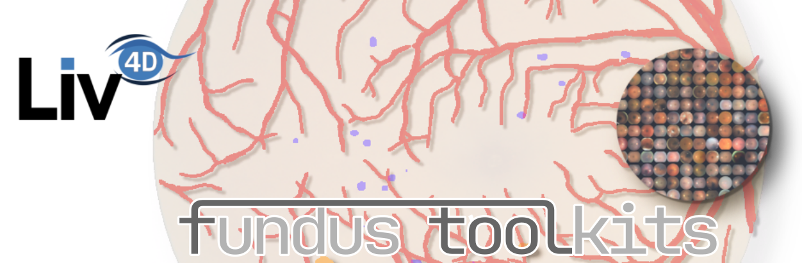

    

# Fundus Toolkits 
The ``fundus-toolkits`` packages are a collection of python packages for automatic analysis of fundus image.
Those packages provide state of the art models and algorithms to automatically segment anatomical and pathological  structures from fundus images and produce an exhaustive representation of the retina. They use a common interface defined in the present `fundus-toolkits-common` package.

Each type of analysis is provided in a separate package, which can be installed independently.

 - [`fundus-vessels-toolkit`](https://github.com/gabriel-lepetitaimon/fundus-vessels-toolkit) provides tools to segment and classify blood vessels, then extract a geometrical and topological representation of the vascular network and finally measure vascular parameters (e.g. tortuosity, AVR, branching coefficients...).
 - [`fundus-lesions-toolkit`](https://github.com/ClementPla/fundus-lesions-toolkit) provides models to segment four retinal lesions from fundus images: exudates, drusen, microaneurysms and hemorrhages.
 - [`fundus-odmac-toolkit`](https://github.com/ClementPla/fundus-odmac-toolkit) provides models to segment the optic disc and macula from fundus images.
 - [`fundus-data-toolkit`](https://github.com/ClementPla/fundus-data-toolkit) provides tools to interact with different publicly available fundus datasets.

## Installation

:warning: This package only provides a common interface for the other packages above. You should probably not install it manually but directly install the package(s) that you are interested in.

